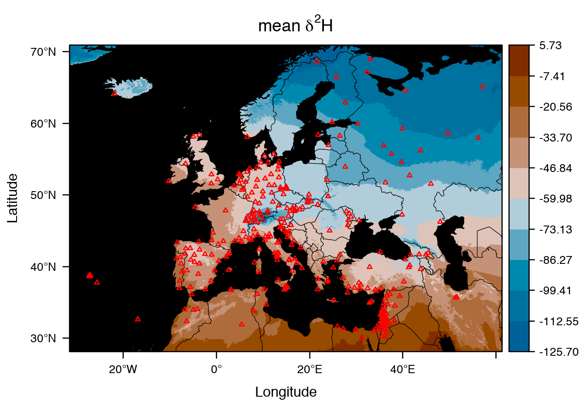

# Welcome to IsoriX
[](https://travis-ci.org/courtiol/IsoriX)
[](https://cran.r-project.org/web/packages/IsoriX)
[](http://www.r-pkg.org/pkg/IsoriX)
[](https://codecov.io/gh/courtiol/IsoriX)
[](https://cran.r-project.org/package=IsoriX)


This is the development repository of __IsoriX__, an [R](https://www.r-project.org/) package aiming at building isoscapes using mixed models and inferring the geographic origin of organisms based on their isotopic ratios.



## How to download and install IsoriX?
You can download and install the stable version of IsoriX directly from within R by typing:

```R
install.packages("IsoriX", dependencies = TRUE)
```

Note: if you get into troubles due to ```gmp```, ```magick```, ```maps```, ```maptools```, ```RandomFields```, ```rgeos```, or ```rgl```, retry using simply:

```R
install.packages("IsoriX")
```

These packages offer additional functionalities but some of them are particularly difficult to install on some systems.

If you want the development version of IsoriX, you can download and install it by typing:

```R
remotes::install_github("courtiol/IsoriX/IsoriX")
```

Mind that you need the R package ```remotes``` to be installed for that to work. Mind also that the development version, being under development, can sometimes be broken. So before downloading it make sure that the current build status is . The current built status is provided at the top of this readme document.

Also, if you access the network via a proxy, you may experience troubles with ```install_github```. In such case try something like:

```R
library(httr)
with_config(use_proxy("192.168.2.2:3128"), devtools::install_github("courtiol/IsoriX/IsoriX"))
```

Off course, unless you are in the same institute than some of us, replace the numbers with your proxy settings!


## Where to learn about IsoriX?

You can start by reading our [bookdown](https://bookdown.org/content/782/)!

Then, if may not be a bad idea to also have a look at our papers:
[here](https://www.biorxiv.org/content/early/2017/10/23/207662) and [there](https://www.elsevier.com/books/tracking-animal-migration-with-stable-isotopes/hobson/978-0-12-814723-8).

Another great source of help is [our mailing list](https://groups.google.com/g/IsoriX).
First register for free (using your Google account) and then feel free to send us questions.

For specific help on IsoriX functions and objects, you should also check the documentation embedded in the package:

```R
help(package = "IsoriX")
```
in R after having installed and attached (= loaded) the package.


## How can you contribute?
There are plenty way you can contribute! If you are fluent in R programming, you can improve the code and develop new functions. If you are not so fluent, you can still edit the documentation files to make them more complete and clearer, write new vignettes, report bugs or make feature requests.

## Some useful links

* about making R packages:

[Simple introduction to the making of R packages](http://r-pkgs.had.co.nz/)

[Writing R extensions](https://cran.r-project.org/doc/manuals/r-release/R-exts.html)

[R coding standard](https://google.github.io/styleguide/Rguide.xml)

* about the environment to develop IsoriX:

[Using version control in RStudio](https://support.rstudio.com/hc/en-us/articles/200532077-Version-Control-with-Git-and-SVN)

* about other R packages on which IsoriX strongly depends:

[spaMM](https://gitlab.mbb.univ-montp2.fr/francois/spamm-ref)

[rasterVis](https://oscarperpinan.github.io/rastervis/)
